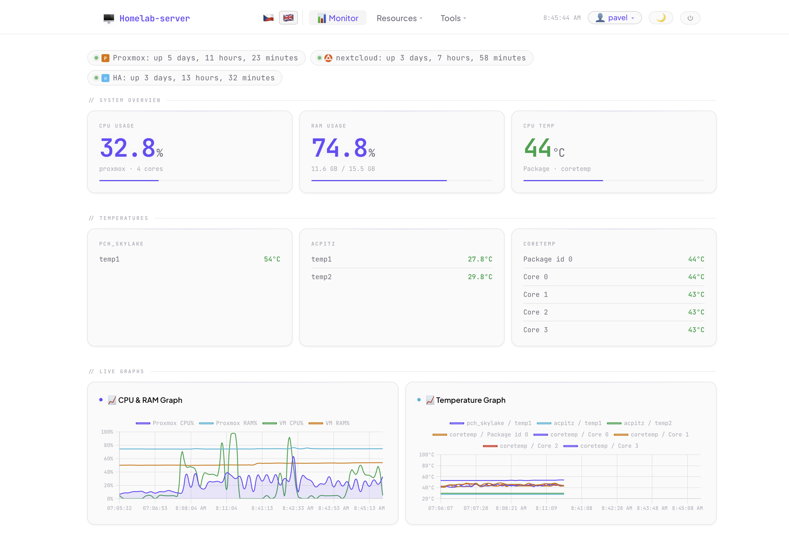
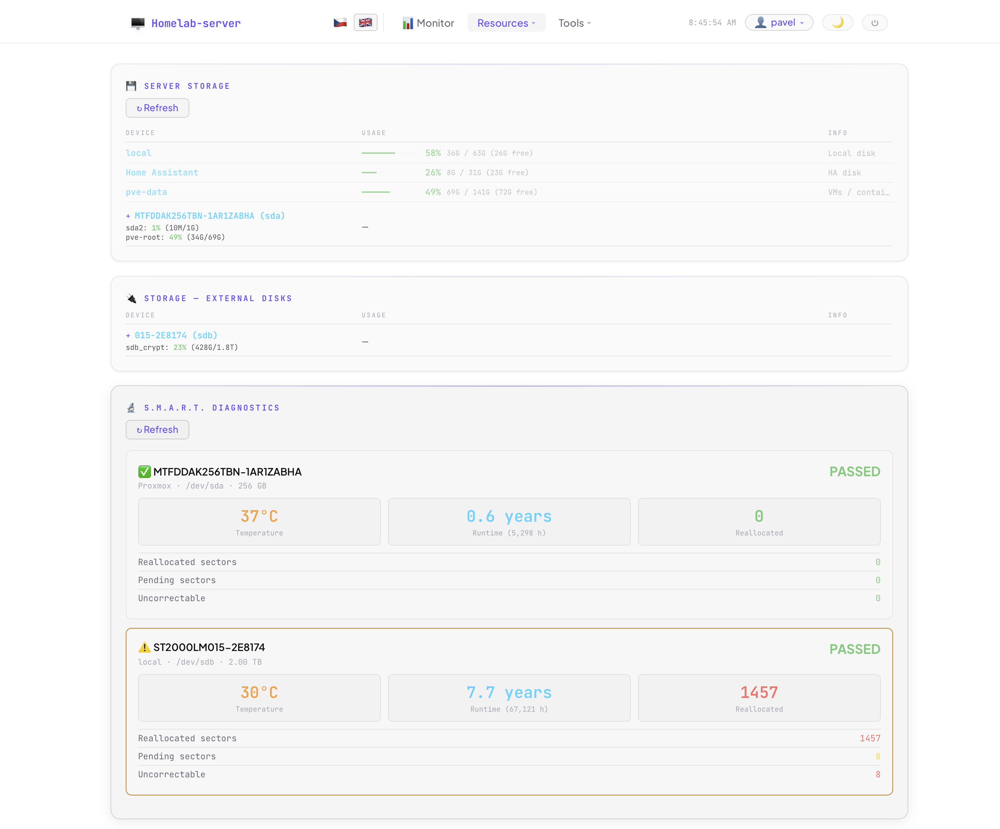
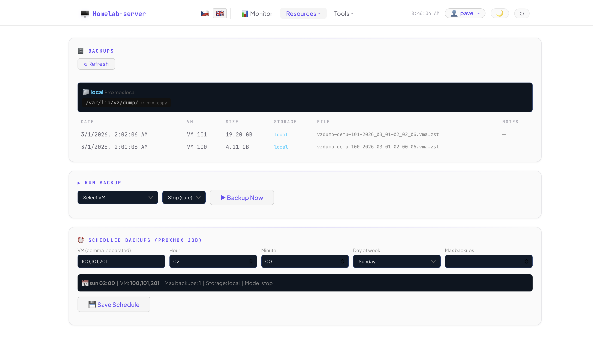
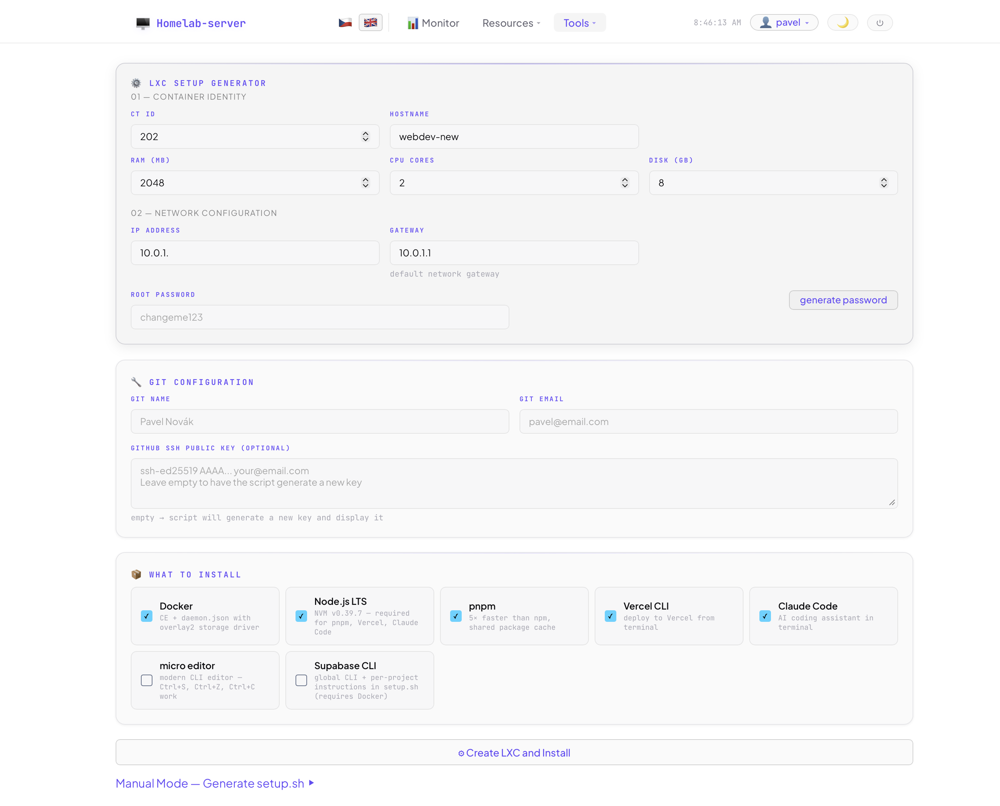
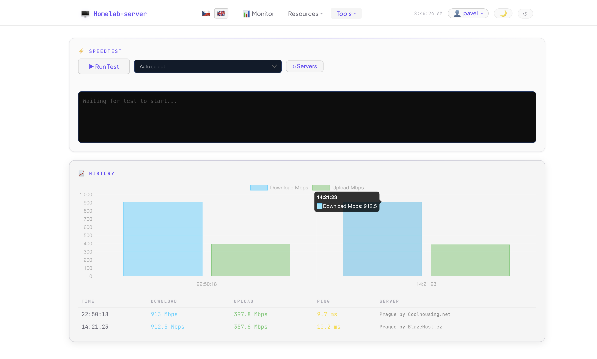

# LXC-Automat

> Self-hosted homelab dashboard with web-based installer for Proxmox

[🇨🇿 Česky](README.cs.md) | 🇬🇧 English

[](https://github.com/pavel-z-ostravy/LXC-Automat/releases)
[](LICENSE)
[](https://github.com/pavel-z-ostravy/LXC-Automat/stargazers)
[](https://www.python.org/)
[](https://www.proxmox.com/)

A config-driven homelab dashboard for Proxmox + optional modules (Home Assistant, Router, Cloudflare, NextDNS). Installs via a single command — a web wizard guides you through the full setup, no config file editing required.

🌐 **[Landing page](https://pavel-z-ostravy.github.io/LXC-Automat)**

---

## Latest Major Updates

| Date | Update |
|------|---------|
| **2026-03-04** | **Cross-browser CSS fixes** — unified appearance across Firefox and Safari: `-webkit-appearance`, custom SVG chevron, background shorthand fix, `-webkit-transform` and `-webkit-user-select` prefixes |
| **2026-03-04** | **Full-page settings panels + btop Cloudflare detection** — Account and Settings as full-page overlays; btop URLs configurable in Settings; local vs. Cloudflare tunnel auto-detected |
| **2026-03-04** | **User menu + Settings panel** — `👤 admin ▾` dropdown; Account panel; Settings with live-editable Modules, WoL, Services and btop URLs — no wizard re-run needed |

---

## Quick Install

```bash
curl -sSL https://raw.githubusercontent.com/pavel-z-ostravy/LXC-Automat/main/install.sh | sudo bash
```

Then open `http://<your-server-ip>:8091/setup` and complete the wizard.

> The setup wizard always runs on port **8091**. During the wizard you choose which port the dashboard itself will use (default: 8091).

---

## How It Works

```
install.sh → [clone + deps + systemd] → /setup wizard (port 8091)
                                               ↓  (after wizard completes)
                                         config.json → dashboard (port 8091)
```

The app automatically detects whether `config.json` exists:
- **Missing** → serves the installer wizard
- **Present** → serves the full dashboard

---

## Screenshots

| | |
|---|---|
|  |  |
| **Monitor** — System Overview: CPU 32.8%, RAM 74.8%, Temp 44°C with progress bars, temperature grid per sensor chip, live CPU & temperature graphs | **Resources — Disks** — Server storage + external disk usage, S.M.A.R.T. diagnostics: temperature, runtime hours, reallocated sectors per drive |
|  |  |
| **Resources — Backups** — Proxmox backup list with VM, size and storage info; manual backup run; scheduled backup job configurator | **Tools — LXC Generator** — Container identity, network config, Git setup, dev tools selection (Docker, Node.js, pnpm, Claude Code) |

| |
|---|
|  |
| **Tools — Speedtest** — One-click network test with live output, download/upload history bar chart, results table with ping and server info |

---

<details>
<summary><b>🧙 Web Installer Wizard</b> — 8-step guided setup, no config editing required</summary>

An 8-step setup wizard — no SSH or config file editing needed:

| Step | What you configure |
|------|-------------------|
| 1. System check | Python, sshpass, paramiko availability |
| 2. Credentials | Dashboard name, port, username + password (SHA-256 hash, with generator) + optional TOTP 2FA |
| 3. Proxmox | IP, node name, SSH auth (password **or** generated keypair) |
| 4. Modules | Home Assistant, Router, Cloudflare, NextDNS (each optional) |
| 5. Services | URLs to monitor for availability |
| 6. WoL devices | Name + MAC + IP for Wake-on-LAN |
| 7. Dev Environment | Optional developer tools to install on the server |
| 8. Review + Install | Shows full config (passwords hidden), saves `config.json` |

### Wizard UX features

- **Language selection screen** — full-screen EN 🇬🇧 / CS 🇨🇿 choice before the wizard starts; can be switched anytime from the header
- **Dashboard name** — sets the browser title and dashboard navbar dynamically
- **Password generator** — generates 32/64/128-char passwords via `crypto.getRandomValues`, shows strength bar
- **Password match indicator** — live ✓/✗ feedback below the confirm field as you type
- **Optional TOTP 2FA** — checkbox in credentials step; generates a QR code to scan in Google Authenticator / Authy, shows the base32 secret for manual entry, and requires a verified 6-digit code before proceeding
- **Grey default values** — pre-filled fields (`admin`, `proxmox`, `root`) appear grey until you type something different
- **Generic placeholders** — IP fields show `e.g. 192.168.1.x` instead of specific addresses
- **Eye icon in review** — reveal password one last time before installing

### SSH key generation (steps 3 & 4)

For Proxmox and Router modules you can choose between password auth or SSH key. If you choose key, the wizard generates an ed25519 keypair, shows the public key with a **Copy** button, and tells you exactly where to paste it (`~/.ssh/authorized_keys`).

</details>

---

<details>
<summary><b>📦 Dashboard Modules</b> — all optional, inactive ones are completely hidden in the UI</summary>

| Module | What it shows |
|--------|--------------|
| **Proxmox** | CPU, RAM, disk, processes, sensors, backups, speedtest |
| **Home Assistant** | Stats from HA VM via SSH |
| **Router** | Per-device network speeds via conntrack |
| **Cloudflare** | Tunnel status, DNS records, cloudflared metrics |
| **NextDNS** | DNS query stats, blocked domains, per-device breakdown |
| **Services** | HTTP availability check for configured URLs |
| **Wake-on-LAN** | Ping status + WoL button for configured devices |
| **LXC Wizard** | One-click LXC container provisioning (see below) |

### LXC Provisioning Wizard

Fill in a form, click **"Create LXC and Install"** — the tool handles everything:

```
[1/9] Verifying CT ID is available...       ✓ CT ID 203 is free
[2/9] Finding Ubuntu 22.04 template...      ✓ local:vztmpl/ubuntu-22.04-...
[3/9] Creating LXC container...             ✓ Container created (2CPU, 2GB, 8GB)
[4/9] Patching .conf for Docker support...  ✓ lxc.apparmor.profile added
[5/9] Starting container...                 ✓ Booting...
[6/9] Waiting for boot (max 90s)...         ✓ Ready after 15s
[7/9] Generating setup.sh...                ✓ Script ready
[8/9] Pushing script into container...      ✓ /root/setup.sh ready
[9/9] Running setup.sh (live output)...

  >>> Updating system...
  ✓ Base packages installed
  >>> Installing Docker...
  ✓ Docker works

╔══════════════════════════════════════════╗
  Ready! SSH: ssh root@192.168.1.93
╚══════════════════════════════════════════╝
```

**Selectable packages:** Docker, Node.js LTS, pnpm, Vercel CLI, Claude Code, Supabase CLI, micro editor, Git config

</details>

---

<details>
<summary><b>🔧 Troubleshooting</b> — wrong password, lost 2FA, service won't start, reset wizard</summary>

> **Note on paths:** Commands below use the default installation name `lxc-automat`. If you chose a different name, substitute it in all commands.

### Wrong password — can't log in

```bash
# Generate a new hash for your chosen password
python3 -c "import hashlib; print(hashlib.sha256(b'YOUR_NEW_PASSWORD').hexdigest())"

# Edit config.json and replace auth.password_hash
nano /opt/lxc-automat/config.json

sudo systemctl restart lxc-automat
```

### Lost TOTP / can't pass 2FA

Edit `config.json` and set `totp_secret` to `null`:

```json
"auth": {
  "username": "admin",
  "password_hash": "...",
  "totp_secret": null
}
```

```bash
sudo systemctl restart lxc-automat
```

### Service fails to start

```bash
sudo journalctl -u lxc-automat -n 50 --no-pager
```

Common causes:
- **`ModuleNotFoundError`** — install the missing package: `/opt/lxc-automat/venv/bin/pip install <module>`
- **Port already in use** — change port in `config.json` and the service file, then `sudo systemctl daemon-reload && sudo systemctl restart lxc-automat`
- **`config.json` syntax error** — validate: `python3 -m json.tool /opt/lxc-automat/config.json`

### Reset the wizard (start from scratch)

```bash
sudo rm /opt/lxc-automat/config.json
sudo systemctl restart lxc-automat
# Then open http://<your-ip>:8091/setup
```

> This only resets configuration. The service, venv, and all files remain intact.

### Re-installing from scratch

```bash
sudo systemctl stop lxc-automat && sudo systemctl disable lxc-automat
sudo rm -rf /opt/lxc-automat
sudo rm /etc/systemd/system/lxc-automat.service
sudo systemctl daemon-reload
```

</details>

---

<details>
<summary><b>🏗️ Architecture & File Structure</b></summary>

```
Browser  ──→  Web UI (single-page HTML + JS, EN/CS)
                │
                ▼
            FastAPI (Python)  ←── config.json
                │
                ├── SSH ──→  Proxmox host
                │              └── pvesh, pct, vzdump, smartctl
                │
                ├── SSH ──→  Home Assistant VM  (if enabled)
                ├── SSH ──→  Router              (if enabled)
                ├── HTTPS ──→ Cloudflare API     (if enabled)
                └── HTTPS ──→ NextDNS API        (if enabled)
```

- **Backend**: Python 3.11+ / FastAPI / Uvicorn
- **Frontend**: Single-page HTML+JS, no framework, no build step
- **Auth**: Cookie session, SHA-256 password hash, optional TOTP 2FA (pyotp)
- **Config**: `config.json` — gitignored, generated by wizard
- **SSH keys**: `keys/` directory — gitignored, generated by wizard

```
/opt/lxc-automat/
├── install.sh             # curl | bash entry point
├── installer.py           # web wizard backend (FastAPI)
├── installer.html         # wizard UI (multi-step form)
├── app.py                 # dashboard backend (config-driven)
├── index.html             # dashboard frontend
├── locales/
│   ├── en.json            # wizard EN translations
│   ├── cs.json            # wizard CS translations
│   ├── dashboard-en.json  # dashboard EN translations
│   └── dashboard-cs.json  # dashboard CS translations
├── requirements.txt
├── lxc-automat.service
├── screenshots/
├── keys/                  # SSH keys (gitignored)
└── config.json            # generated by wizard (gitignored)
```

</details>

---

## Security

> ### ⚠️ Designed for trusted local networks only
> **Do not expose this dashboard directly to the internet.**
> It has no HTTPS, no brute-force protection, and no rate limiting on the login endpoint.
> Use a reverse proxy with HTTPS, or a VPN / Cloudflare Tunnel for remote access.

- `config.json` and `keys/` are gitignored — credentials never reach the repo
- Passwords stored as SHA-256 hash only
- TOTP secret in `config.json` (600 permissions), never logged
- SSH keys have `600` permissions
- No `shell=True` on user input — `shlex.quote()` throughout
- IDs, IPs, hostnames validated with strict regex

---

## Planned Features

- [x] **Theme system** — Midnight Cyan / Obsidian / Matrix / Neue Light, day/night variants, auto-switch
- [x] **Native system monitor** — native HTML components (CPU, RAM, temp, load avg, net speed)
- [ ] LXC template selector (not just Ubuntu 22.04)
- [ ] Container management: start/stop/restart from dashboard
- [ ] Resource monitoring per-container (CPU, RAM, disk)
- [ ] Multi-node Proxmox support
- [ ] Container presets (webdev, database, media server...)
- [ ] Disk health alerts — SMART threshold notifications

---

<details>
<summary><b>📓 Development Notes</b> — session log, iterations, bugs fixed</summary>

### Session log — March 2026

**First iteration (inside private homelab-dashboard):**
- LXC configurator page with script generator
- `POST /api/lxc/create` → 9-step background worker with live log polling
- IP availability check

**Second iteration — extracted to standalone public repo:**
- Web installer wizard (8 steps, `installer.py` + `installer.html`)
- Config-driven `app.py` — all credentials/IPs from `config.json`
- `install.sh` one-command installer + systemd service
- Module-aware frontend — hides inactive sections

**Third iteration — wizard UX improvements:**
- EN/CS language switcher with `locales/` JSON files, `t('key')` function
- Password generator (32/64/128 chars, `crypto.getRandomValues`) + strength bar
- Grey styling for pre-filled defaults · Generic IP placeholders

**Fourth iteration — dashboard i18n + Dev Env wizard step:**
- Full English translation of dashboard frontend (114 keys)
- Flag switcher switches language live without reload
- Dev Environment step — Node.js ecosystem + independent tools
- Background install via `subprocess.Popen`, progress in `dev_install.log`

**Fifth iteration — TOTP two-factor authentication:**
- Optional TOTP 2FA in wizard step 2 — QR code via qrcode.js, verify 6-digit code
- Two-phase login: password → `pending_totp` cookie → `/login/totp` → pyotp verify → session
- Zero overhead when 2FA disabled

**Bugs fixed:**
- `pct restart` → correct command is `pct reboot`
- `python-multipart` missing → FastAPI can't parse login form without it
- Redirect loop after wizard completes → replaced with "restart instructions" page
- Port conflict with existing monitor service → changed to 8091

**Security audit:**
- Removed `shell=True` from speedtest subprocess + `server_id` validated as digits-only
- `vmid`, `mode`, `volid` validated/whitelisted throughout backup endpoints
- LXC script generator: `shlex.quote()` on all user inputs, `printf '%s'` for SSH key injection prevention
- `generate_key` name param validated with regex; `test_ssh` key_path validated against `KEYS_DIR`

---

> Ideas for features, improvements and interface design are from my head,
> but the heavy programming work was done by Claude AI, Sonnet 🙂

</details>
