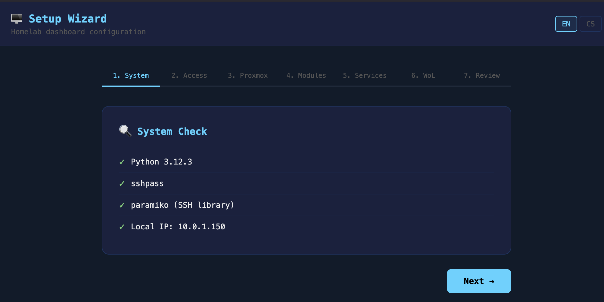
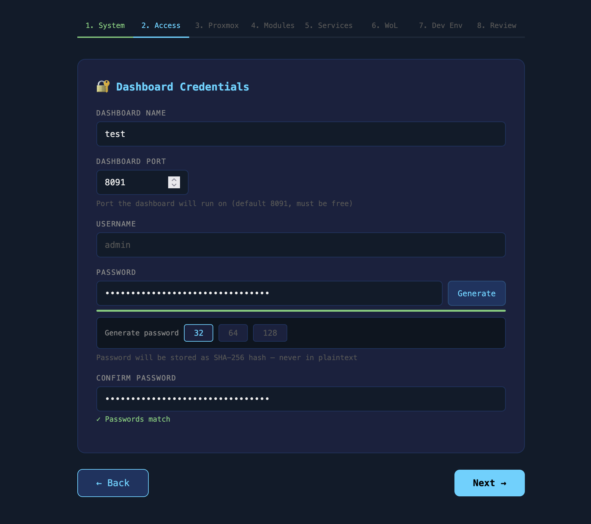
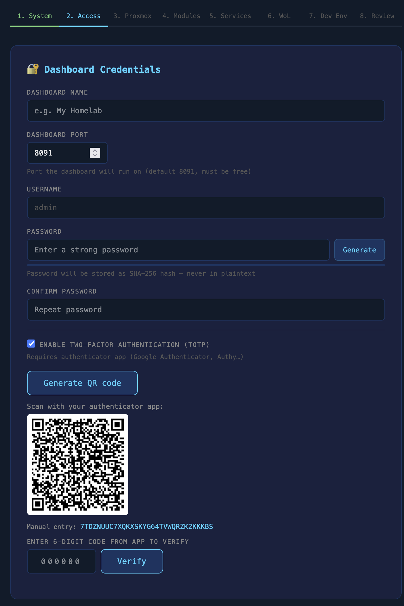
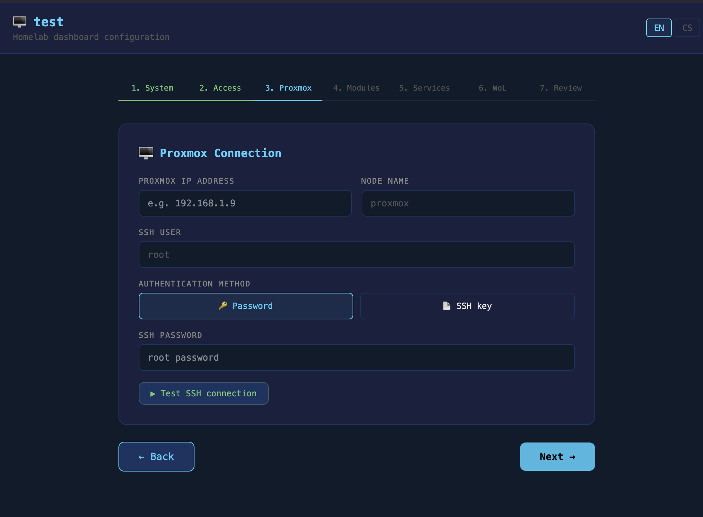
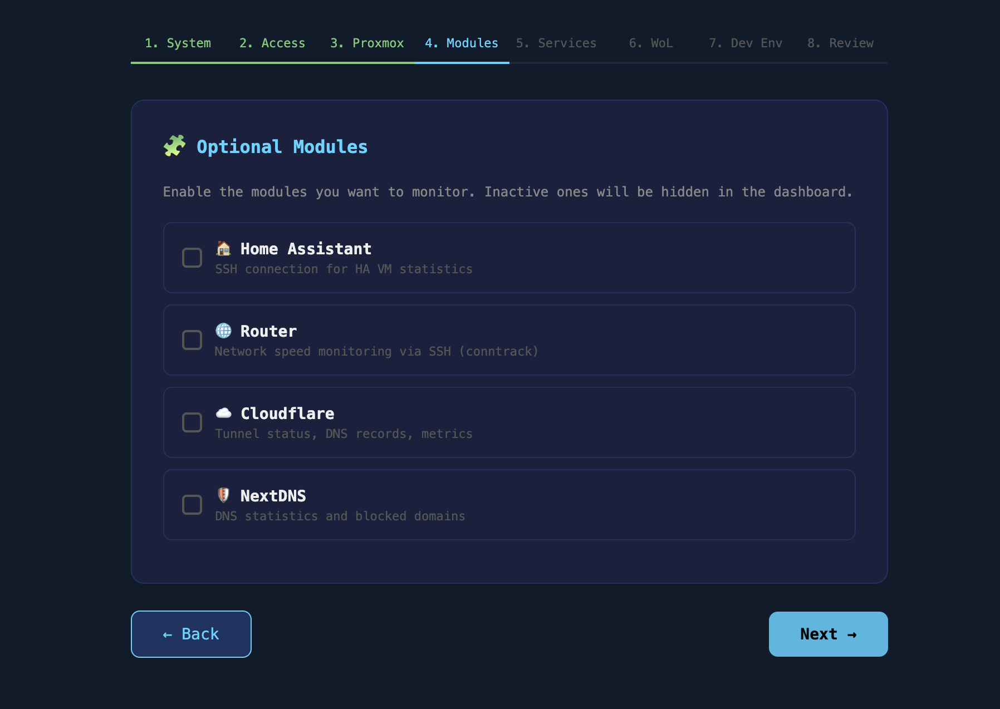
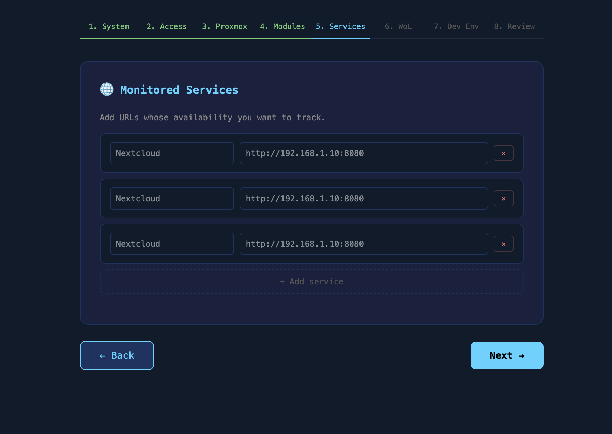
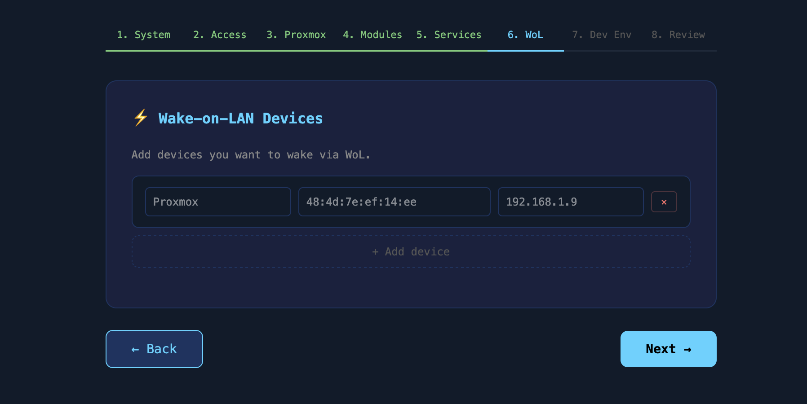
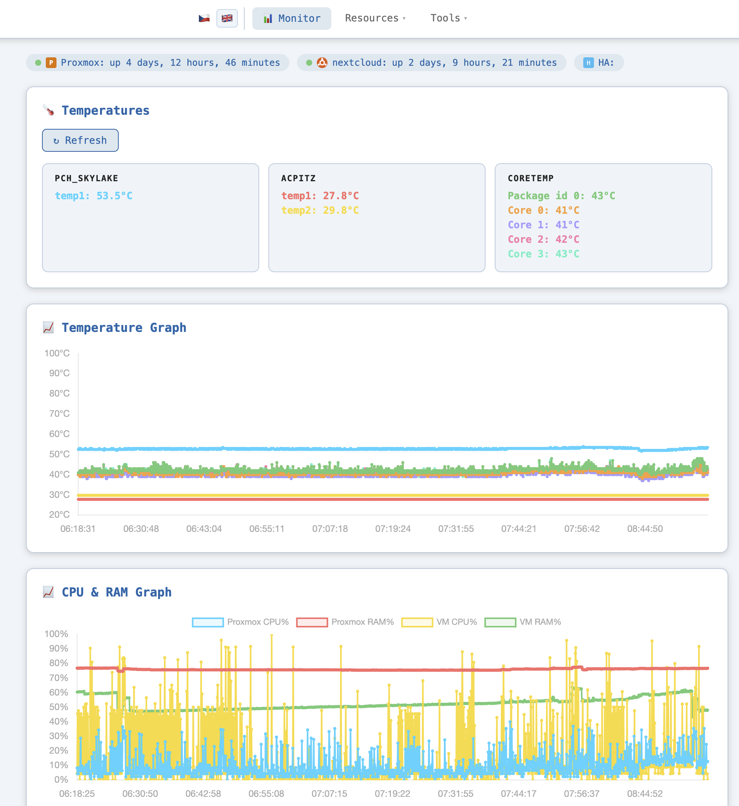
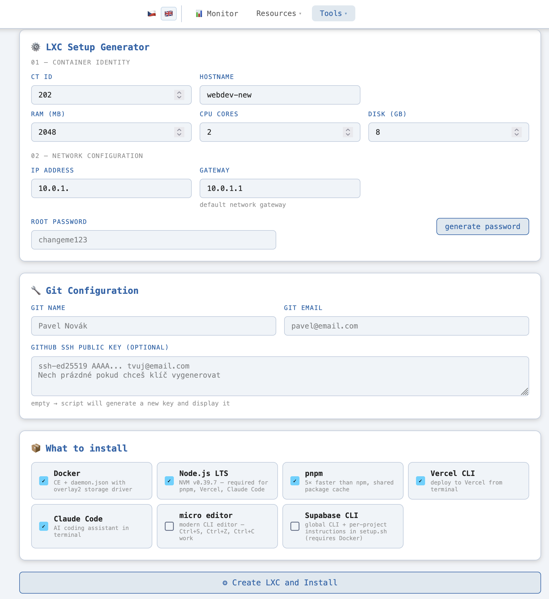

# LXC-Automat

> Self-hosted homelab dashboard with web-based installer

[🇨🇿 Česky](README.cs.md) | 🇬🇧 English

A config-driven homelab dashboard for Proxmox + optional modules (Home Assistant, Router, Cloudflare, NextDNS). Installs via a single command — a web wizard guides you through the full setup, no config file editing required.

---

## Quick Install

```bash
curl -sSL https://raw.githubusercontent.com/pavel-z-ostravy/LXC-Automat/main/install.sh | sudo bash
```

Then open `http://<your-server-ip>:8091/setup` and complete the wizard.

> The setup wizard always runs on port **8091**. During the wizard you choose which port the dashboard itself will use (default: 8091).

---

## How It Works

### Two-phase startup

```
install.sh → [clone + deps + systemd] → /setup wizard (port 8091)
                                               ↓  (after wizard completes)
                                         config.json → dashboard (port 8091)
```

The app automatically detects whether `config.json` exists:
- **Missing** → serves the installer wizard
- **Present** → serves the full dashboard

---

## Web Installer Wizard

An 8-step setup wizard — no SSH or config file editing needed:

| Step | What you configure |
|------|--------------------|
| 1. System check | Python, sshpass, paramiko availability |
| 2. Credentials | Dashboard name, port, username + password (SHA-256 hash, with generator) + optional TOTP 2FA |
| 3. Proxmox | IP, node name, SSH auth (password **or** generated keypair) |
| 4. Modules | Home Assistant, Router, Cloudflare, NextDNS (each optional) |
| 5. Services | URLs to monitor for availability |
| 6. WoL devices | Name + MAC + IP for Wake-on-LAN |
| 7. Dev Environment | Optional developer tools to install on the server |
| 8. Review + Install | Shows full config (passwords hidden), saves `config.json` |

### Wizard UX features

- **Language selection screen** — full-screen EN 🇬🇧 / CS 🇨🇿 choice before the wizard starts; can be switched anytime from the header
- **Dashboard name** — sets the browser title and dashboard navbar dynamically
- **Password generator** — generates 32/64/128-char passwords via `crypto.getRandomValues`, shows strength bar
- **Password match indicator** — live ✓/✗ feedback below the confirm field as you type
- **Optional TOTP 2FA** — checkbox in credentials step; generates a QR code to scan in Google Authenticator / Authy, shows the base32 secret for manual entry, and requires a verified 6-digit code before proceeding
- **Grey default values** — pre-filled fields (`admin`, `proxmox`, `root`) appear grey until you type something different
- **Generic placeholders** — IP fields show `e.g. 192.168.1.x` instead of specific addresses
- **Eye icon in review** — reveal password one last time before installing

### SSH key generation (steps 3 & 4)

For Proxmox and Router modules you can choose between password auth or SSH key. If you choose key, the wizard generates an ed25519 keypair, shows the public key with a **Copy** button, and tells you exactly where to paste it (`~/.ssh/authorized_keys`).

---

## Dashboard Modules

All modules are **optional** — inactive ones are completely hidden in the UI.

| Module | What it shows |
|--------|--------------|
| **Proxmox** | CPU, RAM, disk, processes, sensors, backups, speedtest |
| **Home Assistant** | Stats from HA VM via SSH |
| **Router** | Per-device network speeds via conntrack |
| **Cloudflare** | Tunnel status, DNS records, cloudflared metrics |
| **NextDNS** | DNS query stats, blocked domains, per-device breakdown |
| **Services** | HTTP availability check for configured URLs |
| **Wake-on-LAN** | Ping status + WoL button for configured devices |
| **LXC Wizard** | One-click LXC container provisioning (see below) |

---

## LXC Provisioning Wizard

Fill in a form, click **"Create LXC and Install"** — the tool handles everything:

```
[1/9] Verifying CT ID is available...       ✓ CT ID 203 is free
[2/9] Finding Ubuntu 22.04 template...      ✓ local:vztmpl/ubuntu-22.04-...
[3/9] Creating LXC container...             ✓ Container created (2CPU, 2GB, 8GB)
[4/9] Patching .conf for Docker support...  ✓ lxc.apparmor.profile added
[5/9] Starting container...                 ✓ Booting...
[6/9] Waiting for boot (max 90s)...         ✓ Ready after 15s
[7/9] Generating setup.sh...                ✓ Script ready
[8/9] Pushing script into container...      ✓ /root/setup.sh ready
[9/9] Running setup.sh (live output)...

  >>> Updating system...
  ✓ Base packages installed
  >>> Installing Docker...
  ✓ Docker works
  ...

╔══════════════════════════════════════════╗
  Ready! SSH: ssh root@192.168.1.93
╚══════════════════════════════════════════╝
```

**Selectable packages:** Docker, Node.js LTS, pnpm, Vercel CLI, Claude Code, Supabase CLI, micro editor, Git config

---

## Architecture

```
Browser  ──→  Web UI (single-page HTML + JS, EN/CS)
                │
                ▼
            FastAPI (Python)  ←── config.json
                │
                ├── SSH ──→  Proxmox host
                │              └── pvesh, pct, vzdump, smartctl
                │
                ├── SSH ──→  Home Assistant VM  (if enabled)
                ├── SSH ──→  Router              (if enabled)
                ├── HTTPS ──→ Cloudflare API     (if enabled)
                └── HTTPS ──→ NextDNS API        (if enabled)
```

- **Backend**: Python 3.11+ / FastAPI / Uvicorn
- **Frontend**: Single-page HTML+JS, no framework, no build step
- **Auth**: Cookie session, SHA-256 password hash, optional TOTP 2FA (pyotp), never stored in plaintext
- **Config**: `config.json` — gitignored, generated by wizard
- **SSH keys**: `keys/` directory — gitignored, generated by wizard

---

## Security

> ### ⚠️ Designed for trusted local networks only
> **Do not expose this dashboard directly to the internet.**
> It has no HTTPS, no brute-force protection, and no rate limiting on the login endpoint.
> If you need remote access, put it behind a reverse proxy (e.g. Nginx or Caddy) with HTTPS,
> or use a VPN / Cloudflare Tunnel.

- `config.json` and `keys/` are gitignored — credentials never reach the repo
- Passwords stored as SHA-256 hash only
- TOTP secret stored in `config.json` (600 permissions, gitignored), never logged
- Cloudflare/NextDNS tokens never logged
- SSH keys have `600` permissions

---

## File Structure

```
/opt/monitor-public/
├── install.sh           # curl | bash entry point
├── installer.py         # web wizard backend (FastAPI)
├── installer.html       # wizard UI (multi-step form)
├── app.py               # dashboard backend (config-driven)
├── index.html           # dashboard frontend
├── locales/
│   ├── en.json          # wizard EN translations
│   ├── cs.json          # wizard CS translations
│   ├── dashboard-en.json  # dashboard EN translations
│   └── dashboard-cs.json  # dashboard CS translations
├── requirements.txt
├── monitor-public.service
├── screenshots/         # README screenshots
├── keys/                # SSH keys generated by wizard (gitignored)
└── config.json          # generated by wizard (gitignored)
```

---

## Screenshots

### Setup Wizard

#### Step 1 — System Check
Verifies Python 3, sshpass and paramiko are installed, and detects the local IP address of the server.



#### Step 2 — Dashboard Credentials
Set the dashboard name (updates the browser title live), port, username, and password. Built-in generator produces 32/64/128-char passwords with a strength bar; live ✓/✗ indicator confirms the two fields match.

**Optional: Two-Factor Authentication (TOTP)** — check "Enable 2FA", click **Generate QR code**, scan with Google Authenticator or Authy, and enter the 6-digit code to confirm before proceeding. The base32 secret is displayed for manual entry if QR scanning isn't possible. The wizard requires a successful verification before you can continue.





#### Step 3 — Proxmox Connection
Enter the Proxmox IP address, node name, and SSH credentials. Toggle between password auth and a wizard-generated ed25519 keypair (public key is displayed with a Copy button for pasting into `authorized_keys`). A **Test SSH connection** button validates the credentials before proceeding.



#### Step 4 — Optional Modules
Enable Home Assistant, Router, Cloudflare and/or NextDNS monitoring. Each module expands its own credential form when checked. Inactive modules are completely hidden in the dashboard — no empty cards.



#### Step 5 — Monitored Services
Add any number of URLs (name + URL) to track for HTTP availability. Each service gets a live status indicator on the dashboard.



#### Step 6 — Wake-on-LAN Devices
Register devices by name, MAC address and IP. The dashboard shows live ping status and a one-click WoL button for each.



#### Step 7 — Dev Environment
Optionally install developer tools on the server in the background after the dashboard starts. Tools are grouped into **Node.js ecosystem** (Node.js LTS + pnpm, Vercel CLI, Supabase CLI, Claude Code as dependents) and **Independent tools** (Bun, Docker, Redis, Python 3, micro editor). Progress is logged to `dev_install.log`.


---

### Dashboard

#### Resources — Temperatures & CPU/RAM graphs
The Resources tab shows live sensor readings (PCH, ACPITZ, per-core temperatures) alongside scrolling historical graphs for temperature and CPU/RAM usage (Proxmox host + active VMs). The status bar at the top shows uptime for each monitored system.



#### Tools — LXC Setup Generator
The Tools tab contains the LXC provisioning wizard. Fill in container identity (CT ID, hostname, RAM, CPU, disk), network configuration (IP address with live availability check, gateway), optional Git config, and select which packages to install. Click **Create LXC and Install** to provision the container on Proxmox with a live log stream.



---

## Troubleshooting

### Wrong password — can't log in

The password is stored as a SHA-256 hash in `config.json`. To reset it:

```bash
# Generate a new hash for your chosen password
python3 -c "import hashlib; print(hashlib.sha256(b'YOUR_NEW_PASSWORD').hexdigest())"

# Edit config.json and replace the value of auth.password_hash
nano /opt/monitor-public/config.json
```

Then restart the service:
```bash
sudo systemctl restart monitor-public
```

---

### Lost TOTP / can't pass 2FA

If you've lost access to your authenticator app, disable 2FA directly in `config.json`:

```bash
nano /opt/monitor-public/config.json
```

Find the `auth` section and set `totp_secret` to `null`:

```json
"auth": {
  "username": "admin",
  "password_hash": "...",
  "totp_secret": null
}
```

Restart the service — login will work with password only again:
```bash
sudo systemctl restart monitor-public
```

---

### Service fails to start

Check the logs:
```bash
sudo journalctl -u monitor-public -n 50 --no-pager
```

Common causes:
- **`ModuleNotFoundError`** — a Python dependency is missing. Install it into the venv:
  ```bash
  /opt/monitor-public/venv/bin/pip install <module-name>
  ```
- **Port already in use** — another service is on port 8091. Either stop it or change the port in `config.json` and the service file:
  ```bash
  sudo nano /etc/systemd/system/monitor-public.service
  sudo systemctl daemon-reload && sudo systemctl restart monitor-public
  ```
- **`config.json` syntax error** — validate it:
  ```bash
  python3 -m json.tool /opt/monitor-public/config.json
  ```

---

### Reset the wizard (start setup from scratch)

Deleting `config.json` causes the app to serve the installer wizard again on next start:

```bash
sudo rm /opt/monitor-public/config.json
sudo systemctl restart monitor-public
```

Then open `http://<your-server-ip>:8091/setup` — the full wizard runs again. Your old SSH keys in `keys/` are preserved but can be deleted manually if needed.

> **Note:** This does not uninstall anything — it only resets the configuration. The service, venv, and all files remain intact.

---

### Re-installing from scratch

```bash
sudo systemctl stop monitor-public
sudo systemctl disable monitor-public
sudo rm -rf /opt/monitor-public
sudo rm /etc/systemd/system/monitor-public.service
sudo systemctl daemon-reload
```

Then re-run the install script to start fresh.

---

## Planned Features

- [ ] LXC template selector (not just Ubuntu 22.04)
- [ ] Container management: start/stop/restart from dashboard
- [ ] Resource monitoring per-container (CPU, RAM, disk)
- [ ] Multi-node Proxmox support
- [ ] Container templates (presets: webdev, database, media server...)
- [ ] Re-run wizard to update config (currently requires manual edit)

---

## Development Notes

### Session log — March 2026

**First iteration (inside private homelab-dashboard):**
- LXC configurator page with script generator
- `POST /api/lxc/create` → 9-step background worker with live log polling
- `POST /api/setup/save` + `GET /setup.sh`
- IP availability check

**Second iteration — extracted to standalone public repo:**
- Web installer wizard (8 steps, `installer.py` + `installer.html`)
- Config-driven `app.py` — all credentials/IPs from `config.json`
- Conditional endpoint registration per active module
- `install.sh` one-command installer
- Module-aware frontend — hides inactive sections
- WoL devices loaded dynamically from config

**Bugs fixed:**
- `pct restart` → correct command is `pct reboot`
- `python-multipart` missing → FastAPI can't parse login form without it
- Redirect loop after wizard completes → replaced with "restart instructions" page
- Port conflict with existing monitor service → changed to 8091

**Third iteration — wizard UX improvements:**
- EN/CS language switcher with `locales/` JSON files, `t('key')` function
- Dashboard name field → updates browser title and navbar on the fly
- Password generator (32/64/128 chars, `crypto.getRandomValues`) + strength bar
- Grey styling for pre-filled defaults (`admin`, `proxmox`, `root`)
- Generic IP placeholders (no hardcoded private IPs in the UI)
- `dashboard_name` saved to `config.json`, exposed via `/api/config/modules`

**Security audit & fixes:**
- Removed `shell=True` from speedtest subprocess + `server_id` validated as digits-only
- Backup run: `vmid` validated as digits, `mode` whitelisted to `{stop, suspend, snapshot}`
- Backup delete: `volid` validated against safe character regex
- Backup schedule: `vmids`, `dow`, `hour`, `minute`, `maxfiles` all validated/whitelisted
- LXC script generator: `git_name`, `git_email`, `ssh_key` wrapped with `shlex.quote()` + `printf '%s'` instead of `echo '...'` for SSH key injection prevention
- `generate_key` name param validated with regex whitelist; `test_ssh` key_path validated against `KEYS_DIR`
- LXC params: `ct_id`, `hostname`, `ip`, `gw` validated with strict regexes; `shlex.quote()` on password and template

**Fourth iteration — dashboard i18n + Dev Env wizard step:**
- Full English translation of the dashboard frontend (`locales/dashboard-en.json`, 114 keys)
- Dashboard language defaults to EN; mirrors wizard language choice via `localStorage`
- Flag switcher in navbar switches dashboard language live without reload
- Dev Environment step added to wizard (step 7): Node.js ecosystem + independent tools in 2-col card grid
- Background install via `subprocess.Popen` after wizard completes; progress in `dev_install.log`
- LXC form: added CT ID field + "02 — Network Configuration" section (IP + gateway)

**Fifth iteration — TOTP two-factor authentication:**
- Optional TOTP 2FA added to wizard step 2: checkbox → QR code (qrcode.js) → verify 6-digit code
- `GET /api/installer/generate_totp` + `POST /api/installer/verify_totp` in `installer.py`
- `totp_secret` saved to `config.json` (null when disabled)
- Two-phase login in `app.py`: password → `pending_totp` cookie (120s TTL) → `/login/totp` → pyotp verify → session
- Zero overhead when 2FA is disabled — login flow unchanged

---

> Ideas for features, improvements and interface design are from my head, but the heavy programming work was done by Claude AI, Sonnet 🙂
