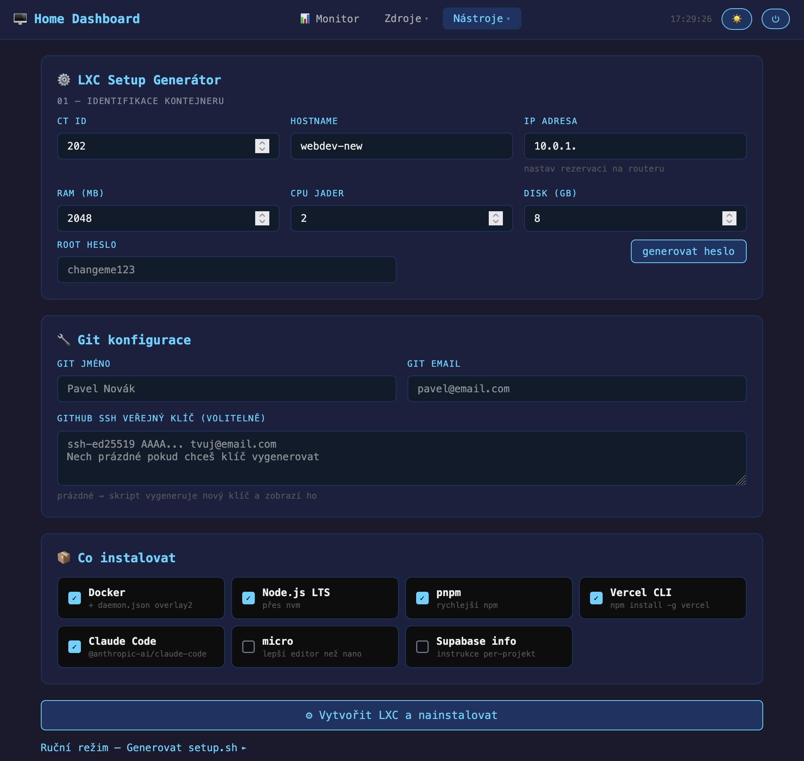
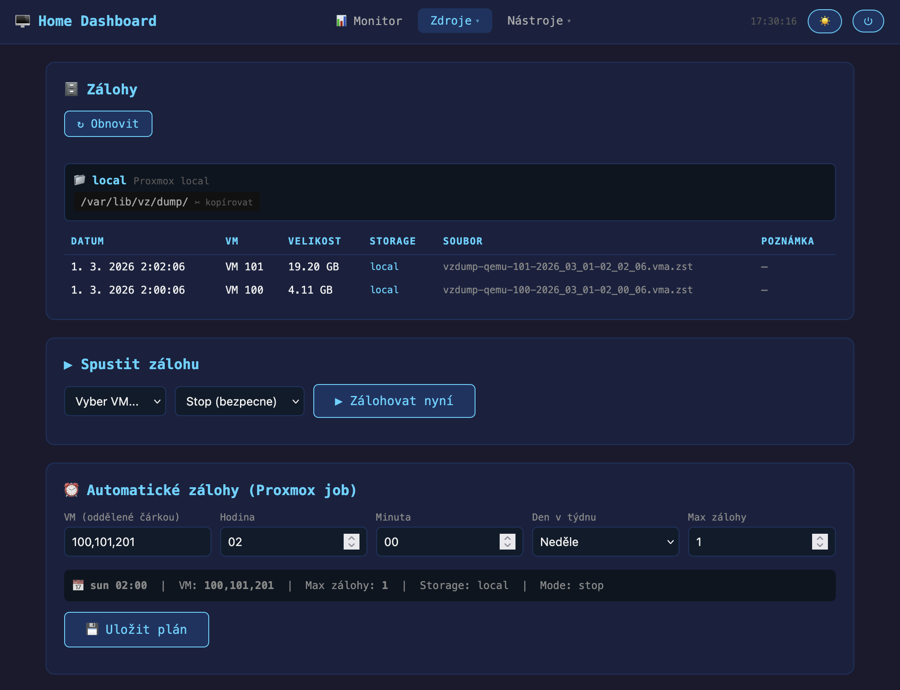
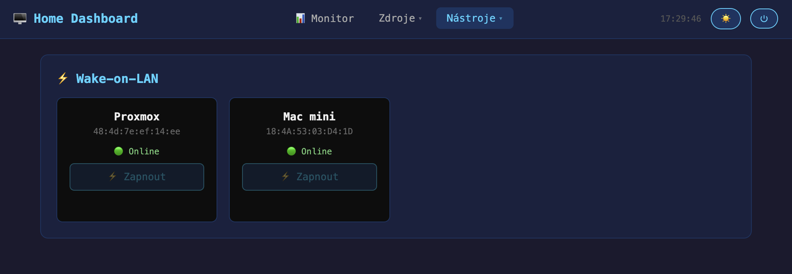

# proxmox-lxc-hud

> One-click LXC provisioning wizard for Proxmox VE

A lightweight web dashboard that automates the full lifecycle of creating and configuring LXC containers on Proxmox — from creation to a fully configured development server, with live progress tracking.

---

## The Problem

Setting up a new LXC container on Proxmox involves too many manual steps:

1. Create container in Proxmox web UI
2. SSH into Proxmox host, edit `/etc/pve/lxc/{id}.conf` for Docker support
3. Reboot container
4. Copy setup script into container
5. SSH in, run the script, wait
6. Hope nothing broke silently

**proxmox-lxc-hud turns this into a single button click.**

---

## What It Does

### LXC Provisioning Wizard

Fill in a form, click **"Create LXC and Install"** — the tool handles everything:

```
[1/9] Verifying CT ID is available...       ✓ CT ID 203 is free
[2/9] Finding Ubuntu 22.04 template...      ✓ local:vztmpl/ubuntu-22.04-...
[3/9] Creating LXC container...             ✓ Container created (2CPU, 2GB, 8GB)
[4/9] Patching .conf for Docker support...  ✓ lxc.apparmor.profile added
[5/9] Starting container...                 ✓ Booting...
[6/9] Waiting for boot (max 90s)...         ✓ Ready after 15s
[7/9] Generating setup.sh...               ✓ Script ready (4.2 KB)
[8/9] Pushing script into container...      ✓ /root/setup.sh ready
[9/9] Running setup.sh (live output)...

  >>> Updating system...
  ✓ Base packages installed
  >>> Installing Docker...
  ✓ Docker works
  >>> Installing Node.js LTS...
  ✓ Node.js v22.x installed
  ...

╔══════════════════════════════════════════╗
  Ready! SSH: ssh root@10.0.1.93
  Password: Xk9#mP2...
╚══════════════════════════════════════════╝
```

### Configurable Parameters

| Field | Default | Description |
|-------|---------|-------------|
| CT ID | — | Proxmox container ID |
| Hostname | — | Container hostname |
| IP address | — | Static IP (auto-checked for availability) |
| RAM | 2048 MB | Memory allocation |
| CPU cores | 2 | vCPU count |
| Disk | 8 GB | Root filesystem size |
| Root password | generated | Auto-generate or custom |

### Software Packages (selectable)

- **Docker** — with overlay2 storage driver, configured for LXC
- **Node.js LTS** — via nvm
- **pnpm** — fast package manager
- **Vercel CLI** — deploy from container
- **Claude Code** — AI coding assistant
- **micro** — modern terminal editor
- Git configuration (name, email, SSH key or auto-generate)

### IP Availability Check

Before provisioning, the dashboard pings the target IP and warns if it's already in use on the network.

### Manual Mode (fallback)

For users who prefer manual setup, a collapsible **Manual Mode** section provides:
- Step-by-step instructions for `.conf` editing
- `setup.sh` generator with copy/download/push-to-server options
- `pct push` + `pct exec` commands ready to run

---

## Architecture

```
Browser  ──→  Web UI (single-page HTML + JS)
                │
                ▼
            FastAPI (Python)
                │
                ├── SSH ──→  Proxmox Host (root@proxmox)
                │              └── pvesh create/start/exec
                │              └── pct push / pct exec
                │
                └── Local setup.sh generation
```

- **Backend**: Python (FastAPI), single file `app.py`
- **Frontend**: Single-page HTML/JS, no framework, no build step
- **Auth**: Cookie-based session (SHA-256 password hash)
- **Proxmox connection**: SSH key auth to Proxmox host

---

## Planned Features

- [ ] Auto-install: web-based installer with variable input (Proxmox IP, SSH key, credentials)
- [ ] LXC template selector (not just Ubuntu 22.04)
- [ ] Container management: start/stop/restart from dashboard
- [ ] Resource monitoring per-container (CPU, RAM, disk)
- [ ] GitHub SSH key auto-push to container
- [ ] 1Password CLI integration for credential storage
- [ ] Multi-node Proxmox support
- [ ] Container templates (presets: webdev, database, media server...)

---

## Current Status

> **Alpha / Personal use** — running in production on a homelab Proxmox setup.
> Repo created: March 2026.

The LXC wizard is functional. The project currently lives as a module inside a larger homelab dashboard. The plan is to extract it into a standalone installable tool.

---

## Screenshots

### LXC Wizard — konfigurace a spuštění


### Zálohy — správa Proxmox záloh


### Wake-on-LAN


---

## Related Projects

| Project | Focus |
|---------|-------|
| [Pulse](https://github.com/rcourtman/Pulse) | Proxmox monitoring dashboard |
| [proxmox-dashboard](https://github.com/anomixer/proxmox-dashboard) | Node/VM/LXC monitoring |
| [awesome-proxmox-ve](https://github.com/Corsinvest/awesome-proxmox-ve) | Curated Proxmox tools list |

**Gap this project fills:** None of the above automate LXC *provisioning* — they monitor what's already running.

---

## Development Notes

### Session log — March 2026

**What we built (first iteration, inside homelab-dashboard):**
- LXC configurator page with script generator (`lxcGenerate()`)
- Backend endpoint `POST /api/lxc/create` → 9-step background worker
- `GET /api/lxc/poll/{job_id}` for live log polling
- `POST /api/setup/save` → saves script locally + SCP to Proxmox
- `GET /setup.sh` → serves script for `curl | bash` installs
- IP availability check via existing `/api/ping` endpoint

**Bugs fixed along the way:**
- `pct restart` → correct command is `pct reboot`
- `PermitRootLogin` not set on fresh Ubuntu LXC → fixed with `sed -i '/PermitRootLogin/d' && echo "PermitRootLogin yes" >>`
- `curl` not available in fresh container → switched to `pct push` + `pct exec`
- `navigator.clipboard` fails on HTTP → added `execCommand` fallback
- `apt upgrade` interactive dialog for openssh-server → fixed with `DEBIAN_FRONTEND=noninteractive` + `--force-confold`

**Source repo (private, full homelab dashboard):** `github.com/pueblo78/homelab-dashboard`
